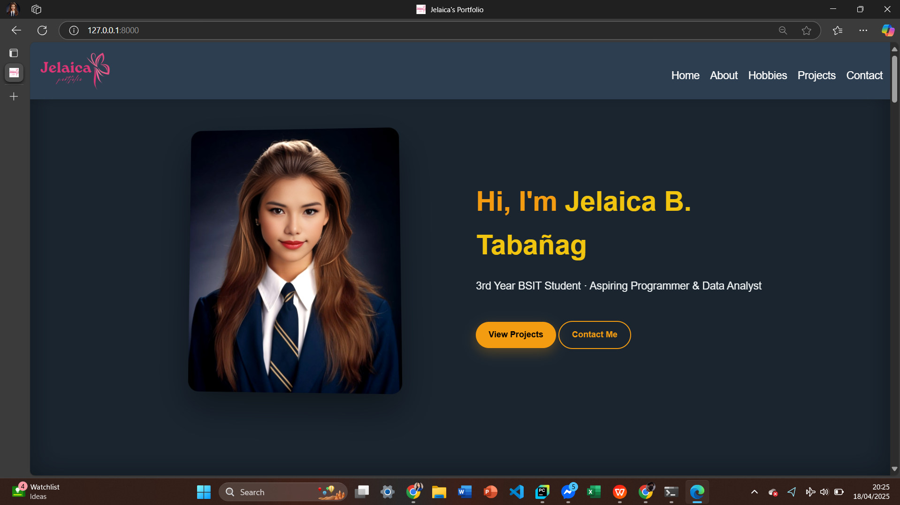
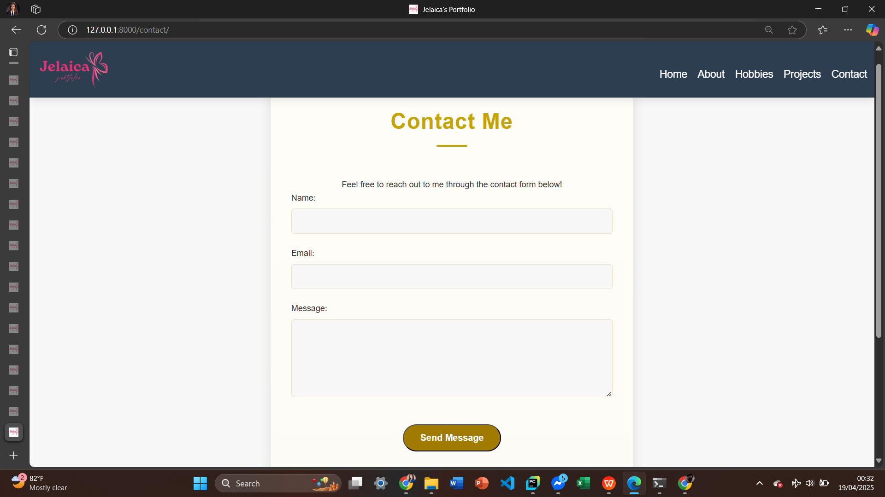
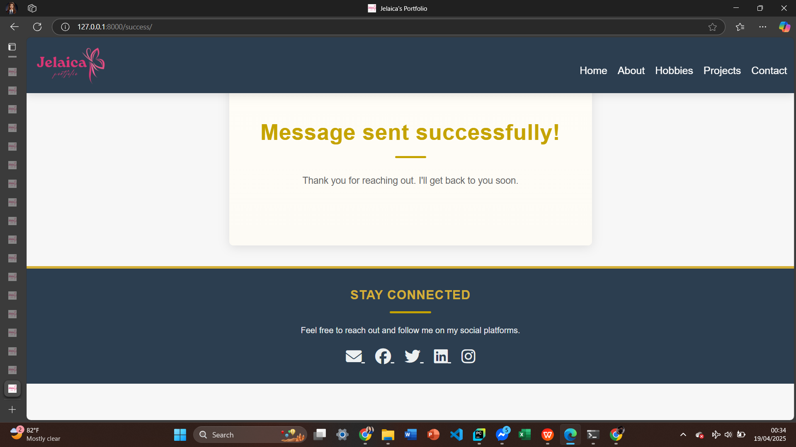
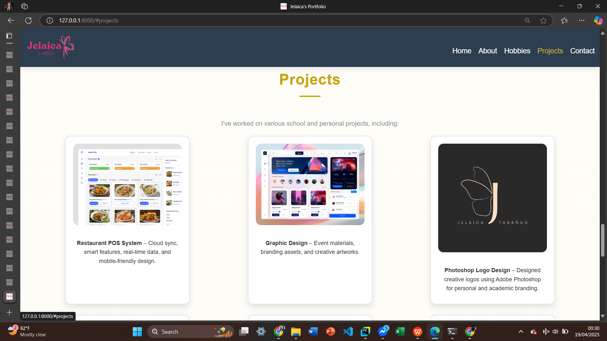
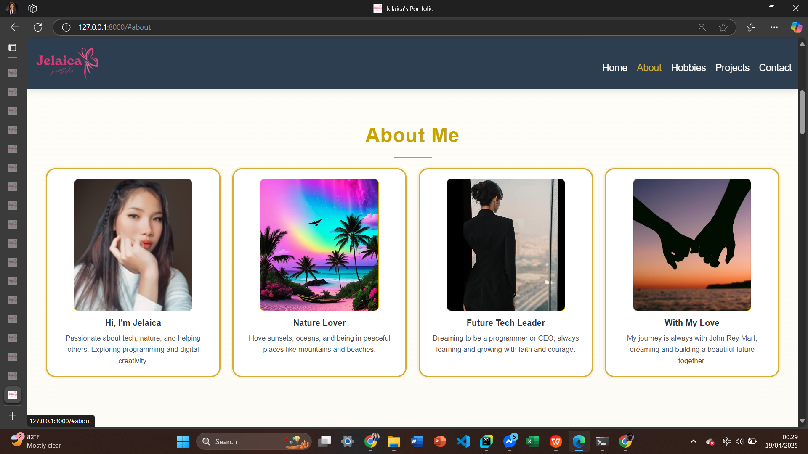
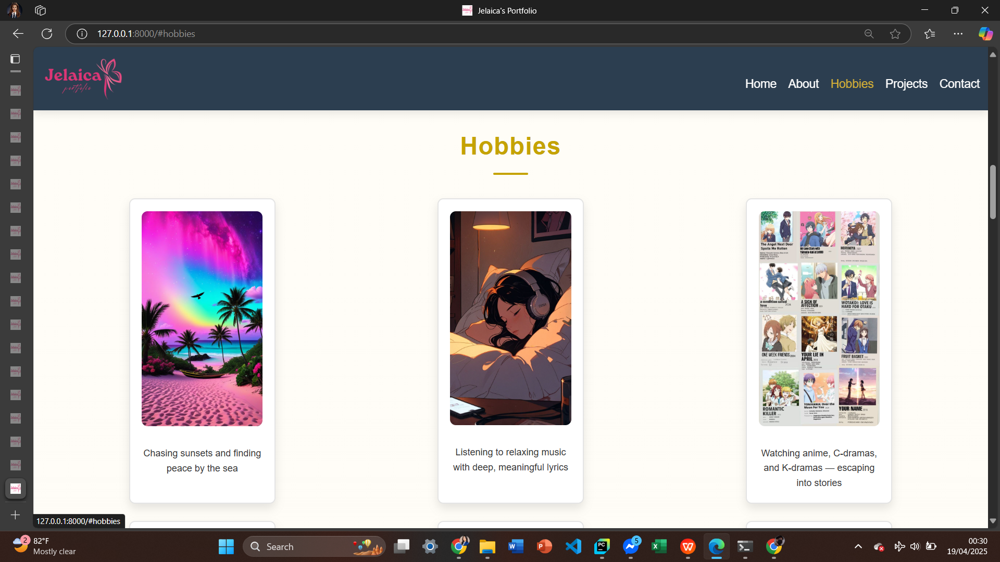
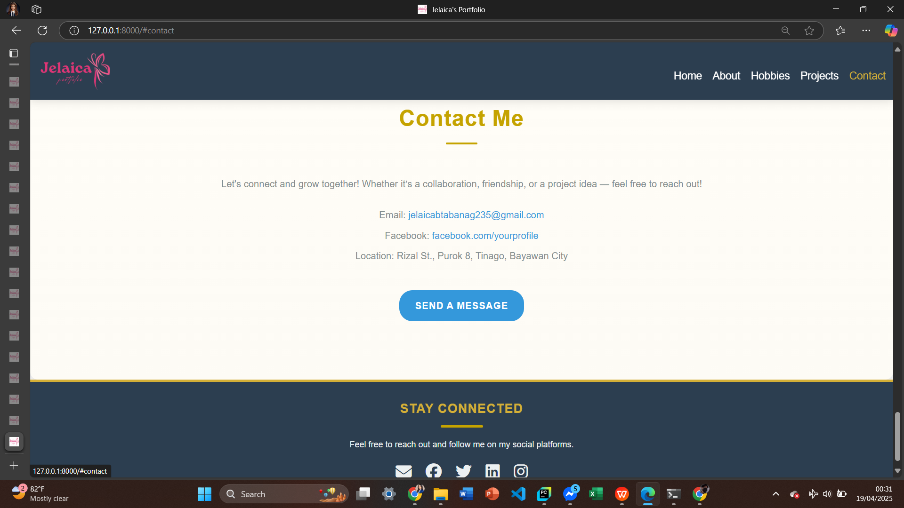

# 💼 My Portfolio

Welcome to my personal portfolio website built with **Django**!  
This site is a reflection of my journey, showcasing my **skills**, **projects**, and **experiences** as an aspiring IT professional.

---

## 🌟 Features

✨ Django-powered web application  
✨ Clean and responsive design  
✨ Dynamic project showcase section  
✨ About Me section with interactive cards  
✨ Contact form *(coming soon!)*  

---

## 🛠 Tech Stack

- **Backend:** Python, Django  
- **Frontend:** HTML5, CSS3, JavaScript  
- **Tools:** Git, GitHub, Render  

---

## 🚀 Deployment

This portfolio is hosted on **Render** and connected to **GitHub** for continuous deployment.  
✅ Every push to `main` triggers an automatic redeploy on Render.

🌐 **Live Site:** *Coming soon*

---

## 📸 Screenshots

### 🏠 Homepage

### 💬 Contact Form

### ✅ Message Sent Successfully

### 📂 Projects Section

### 🧑‍💼 About Me

### 🎯 Hobbies Section

### 📞 Contact Section

---

## 📬 Contact

If you'd like to collaborate, hire me, or simply connect:

📧 Email: *[jelaicabtabanag@gmail.com]*  
🌐 GitHub: [@jelaica22](https://github.com/jelaica22)

---

## 🤍 Credits

Built with love and passion by  
**[Jelaica B. Tabañag](https://github.com/jelaica22)**  
Putting God first in everything I do.

---

> 📌 *Feel free to fork this project and customize it for your own portfolio!*
